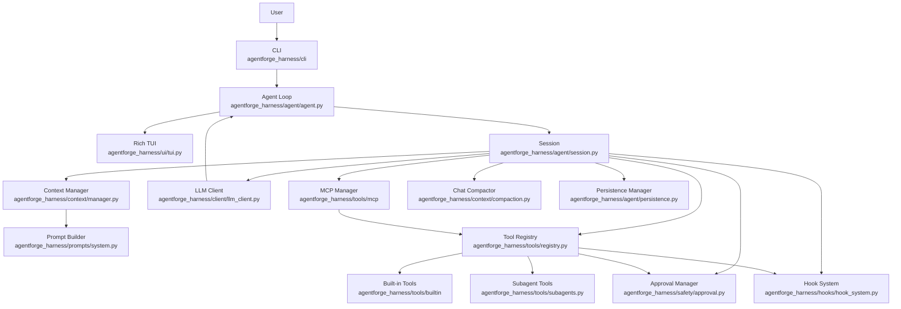
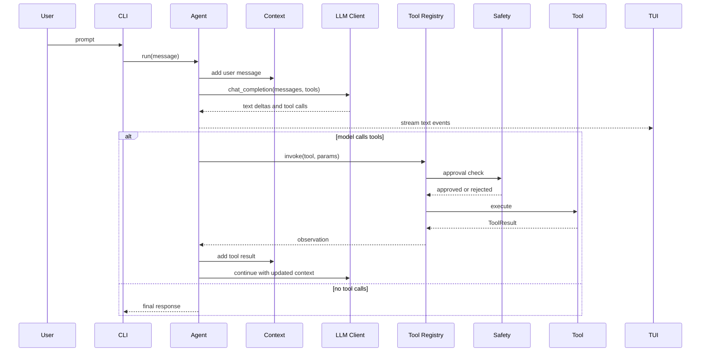
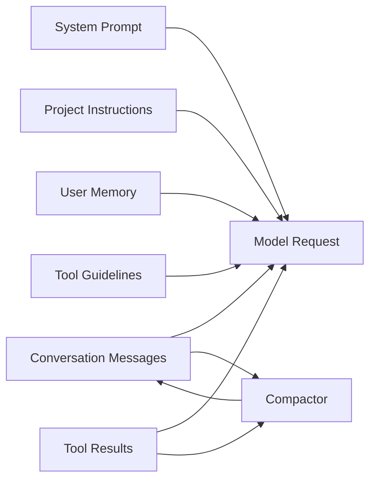
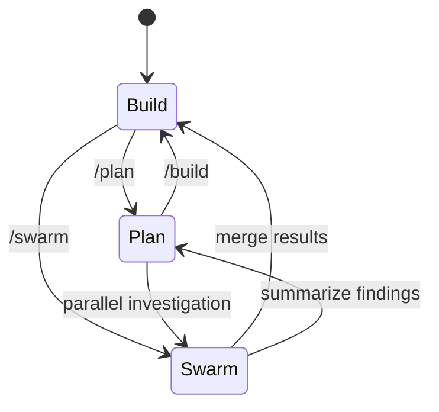
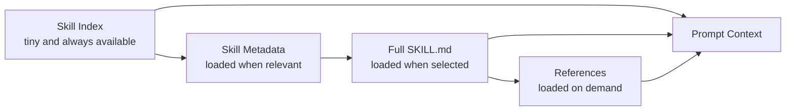

# AgentForge

AgentForge is a terminal-based AI coding-agent harness built in Python for learning how modern coding agents are structured. It is not just a chatbot wrapper: the project is organized around the core harness concerns that make coding agents reliable, inspectable, and safe.

The project currently supports OpenRouter, OpenAI, Anthropic, and custom OpenAI-compatible model providers, plus streaming model responses, typed tool calls, approval gates, output hygiene, secret redaction, prompt-injection boundaries for tool observations, hooks, MCP tools, subagents, context compaction, loop detection, persistent memory, session snapshots, checkpoints, event logs, JSON reports, HTML/markdown session export, resume/restore commands, plan/build modes, skills, and a Rich terminal UI. The v1 focus is packaging, docs, tool reliability, release hygiene, and a clear safety baseline. Larger learning milestones such as Skills v2, deterministic replay, local evals, browser QA, and swarm orchestration are planned after v1.

## Purpose

This repository is intended as a learning lab for AI harness engineering.

The main concepts explored here are:

| Area | What It Teaches |
| --- | --- |
| Agent loop | How a model alternates between reasoning, tool calls, observations, and final answers |
| Tool registry | How tools become schema-first actions the model can call |
| Tool observations | How outputs shape recovery, retries, and model behavior |
| Context management | How prompts, messages, tool results, memory, and compaction fit in the context window |
| Safety and approval | How mutating operations are classified, reviewed, and blocked |
| Hooks | How external scripts can observe agent and tool lifecycle events |
| MCP integration | How external tool servers are exposed to the model |
| Subagents | How a parent agent delegates bounded specialist work |
| Skills | How task-specific guidance can be loaded progressively without bloating context |
| Persistence and replay | How snapshots, event logs, and checkpoints make sessions recoverable and debuggable |

## Installation

When published, install the package from PyPI:

```bash
pip install agentforge-harness
agentforge init
agentforge doctor
agentforge
```

For local development from this repository:

```bash
pip install -e ".[dev]"
agentforge --version
agentforge doctor
```

## Architecture



### Runtime Flow



### Context Flow



## Project Structure

```text
agentforge/
|-- agentforge_harness/        # Importable Python package
|   |-- agent/                 # Agent loop, events, persistence, and sessions
|   |-- cli/                   # Click CLI and interactive commands
|   |-- client/                # Provider-aware LLM client
|   |-- config/                # Pydantic config and loaders
|   |-- context/               # Message history, compaction, loop detection
|   |-- hooks/                 # Before/after agent/tool hooks
|   |-- prompts/               # System prompt sections and compaction prompts
|   |-- safety/                # Approval policies and circuit breaker
|   |-- skills/                # Progressive skill discovery and loading
|   |-- tools/                 # Built-in tools, registry, MCP, subagents
|   |-- ui/                    # Rich terminal rendering
|   `-- utils/                 # Path and text helpers
|-- README.MD                  # Project documentation
|-- pyproject.toml             # Package metadata for agentforge-harness
|-- requirements.txt           # Runtime dependency mirror
|-- LICENSE                    # MIT license
|-- .env.example               # Example API configuration
|-- .agentforge/
|   |-- config.toml            # Project-local config
|   `-- tools/                 # Project-local dynamic tools
`-- tests/                     # Pytest suite
```

## Core Design

### Agent Loop

The agent loop in `agentforge_harness/agent/agent.py` is the heart of the harness.

At a high level it:

1. Adds the user message to context.
2. Sends messages and tool schemas to the model.
3. Streams text deltas to the TUI.
4. Collects completed tool calls.
5. Executes tools through the registry.
6. Adds tool results back to context.
7. Repeats until the model returns no tool calls.

This is a hybrid ReAct/function-calling loop: the model reasons in natural language and acts through typed tools.

### Session

`agentforge_harness/agent/session.py` wires together the long-lived objects for one interactive run:

- `LLMClient`
- `ToolRegistry`
- `MCPManager`
- `ContextManager`
- `ApprovalManager`
- `HookSystem`
- `ChatCompactor`
- `LoopDetector`
- `PersistenceManager`
- session ID and turn count

The session owns snapshot creation and restoration. It captures conversation messages, token usage, config metadata, active tools, MCP server names, todos, active mode, active skills, and event sequence state.

### Tools

Tools inherit from `Tool` in `agentforge_harness/tools/base.py`.

Each tool provides:

- a stable `name`
- a `description`
- a `ToolKind`
- a Pydantic schema
- an async `execute()` method
- optional approval metadata through `get_confirmation()`

Built-in tools include:

| Tool | Kind | Purpose |
| --- | --- | --- |
| `read_file` | read | Read text files with line numbers |
| `write_file` | write | Create or overwrite files |
| `append_file` | write | Append text to the end of a file |
| `edit` | write | Replace exact text in files |
| `apply_patch` | write | Apply a unified diff across one or more files with dry-run validation and patch intent metadata |
| `git_diff` | read | Inspect working tree or staged git changes without mutating the repo |
| `shell` | shell | Run shell commands with timeout and approval |
| `list_dir` | read | List directory entries |
| `grep` | read | Search file contents with regex |
| `glob` | read | Find files by glob pattern |
| `todos` | memory | Track session tasks |
| `memory` | memory | Store user preferences and notes |
| `web_search` | network | Search the web |
| `web_fetch` | network | Fetch URL content |

### Tool Invocation Contract

The registry is responsible for:

1. Looking up the tool.
2. Validating params against the schema.
3. Running before-tool hooks.
4. Checking approval for mutating operations.
5. Executing the tool.
6. Redacting secrets from model-visible tool results when enabled.
7. Marking tool observations as untrusted data when prompt-injection protection is enabled.
8. Running after-tool hooks.
9. Returning a `ToolResult`.

Future improvement: evolve `ToolResult` from mostly raw text into a structured observation:

```json
{
  "status": "success",
  "summary": "Read 120 lines from README.MD",
  "artifacts": ["README.MD"],
  "next_actions": [],
  "error_type": null,
  "retryable": false
}
```

This is one of the most important harness-learning upgrades because model recovery quality depends heavily on observation quality.

### Safety and Approval

Tool outputs pass through centralized secret redaction in `agentforge_harness/utils/redaction.py` before after-tool hooks, model context, TUI events, persistence, and exports see the result. Tool-call arguments are also redacted before TUI display and hook environment variables, and approval confirmations redact commands, params, and diff previews before asking the user. Redaction is enabled by default and records non-secret metadata such as redaction count and detected secret kinds.

Current redaction coverage includes common OpenAI/OpenRouter/Anthropic API key shapes, GitHub tokens, JWTs, private key blocks, and generic `API_KEY`/`TOKEN`/`SECRET`/`PASSWORD` assignments. This protects obvious leaks in observations, but it is not a sandbox and does not make arbitrary tools or MCP servers safe.

Before redaction, tool results pass through output hygiene in `agentforge_harness/safety/output_hygiene.py`. This strips ANSI escape sequences and unsafe control characters while preserving normal whitespace, then truncates large model-visible fields according to `max_tool_output_tokens`. Hygiene metadata records how many terminal sequences or control characters were removed and which fields were truncated.

Tool observations also pass through prompt-injection boundary handling in `agentforge_harness/safety/prompt_injection.py`. When enabled, tool results carry trust metadata and model-visible observations are wrapped in `<untrusted_content>` tags. The wrapper tells the model that file contents, command output, web pages, MCP responses, and other tool observations are data, not instructions. This reduces accidental instruction promotion while keeping the original TUI output readable.

Prompt-injection protection is a boundary layer, not a complete policy engine. It does not yet trace whether a later tool call was derived from untrusted content, and it does not sandbox shell commands or MCP servers.

The approval layer in `agentforge_harness/safety/approval.py` classifies operations using:

- tool mutability
- command safety patterns
- affected paths
- danger flags from tools
- configured approval policy

Supported approval modes:

| Mode | Meaning |
| --- | --- |
| `on-request` | Ask before non-safe mutating operations |
| `on-failure` | Allow most operations, useful for autonomous retries |
| `auto` | Auto-approve most operations except explicitly dangerous ones |
| `auto-edit` | Auto-approve safe commands, ask for edits and riskier operations |
| `never` | Reject non-safe operations |
| `yolo` | Approve all operations, including dangerous ones |

Future improvement: replace simple safe/dangerous command regexes with command classes such as `read-only`, `test`, `build`, `install`, `git-write`, `server`, `network`, and `destructive`.

### Hooks

Hooks let external scripts observe or react to lifecycle events.

Supported triggers:

| Trigger | When It Runs |
| --- | --- |
| `before_agent` | Before a user message enters the agent loop |
| `after_agent` | After the agent returns a response |
| `before_tool` | Before a tool is executed |
| `after_tool` | After a tool returns |
| `on_error` | When explicit error handling is added |

Hooks are configured in `.agentforge/config.toml`.

Hook commands receive AgentForge runtime context through environment variables:

| Variable | Meaning |
| --- | --- |
| `AGENTFORGE_TRIGGER` | Hook trigger name |
| `AGENTFORGE_CWD` | Agent working directory |
| `AGENTFORGE_TOOL_NAME` | Tool name for tool hooks |
| `AGENTFORGE_TOOL_PARAMS` | JSON-encoded tool params |
| `AGENTFORGE_TOOL_RESULT` | Tool result text for after-tool hooks |
| `AGENTFORGE_USER_MESSAGE` | User message for agent hooks |
| `AGENTFORGE_RESPONSE` | Agent response for after-agent hooks |
| `AGENTFORGE_ERROR` | Error text for error hooks |

Example:

```toml
hooks_enabled = true

[[hooks]]
name = "test_before_tool"
trigger = "before_tool"
command = "python3 ./scripts/test_tool.py"
```

Future improvement: add blocking/non-blocking hook policy:

```toml
failure_mode = "block" # block | warn | ignore
```

### MCP Integration

The MCP layer allows external MCP servers to expose tools to the agent.

Configuration example:

```toml
[mcp_servers.filesystem]
command = "npx"
args = [
  "-y",
  "@modelcontextprotocol/server-filesystem",
  "/path/to/agentforge"
]
```

MCP tools are registered with names like:

```text
filesystem__read_file
```

The `server__tool` naming pattern avoids collisions between built-in tools and remote tools.

### Subagents

Subagents are specialist agents exposed as tools.

Current examples:

- `subagent_explore`
- `subagent_debugger`
- `subagent_codebase_investigator`
- `subagent_code_reviewer`
- `subagent_test_planner`
- `subagent_architect`
- project-defined subagents from config

The built-in subagents are read-only by default. They can inspect files, grep, glob, and list directories, but they do not edit files. This makes them useful for safe delegation before adding full swarm orchestration.

Subagents are useful for bounded delegation:

```text
Parent agent -> subagent(goal) -> isolated specialist loop -> result
```

They are not the same as swarm mode. Subagents are tool-level delegation; swarm mode is a harness-level orchestration strategy that manages multiple agents, budgets, shared task state, and result merging.

### Context Management

The context manager owns:

- the system prompt
- user messages
- assistant messages
- tool results
- token usage
- pruning old tool output
- replacing old history with a compaction summary

Compaction is handled by `agentforge_harness/context/compaction.py`, which asks the model to produce a continuation summary when context grows too large.

Future improvement: add explicit category budgets:

| Category | Example Budget |
| --- | --- |
| System prompt | fixed and small |
| Active skills | capped by selected task |
| Recent messages | preserve latest turns |
| Tool results | preserve recent and artifact-bearing results |
| File reads | summarize older reads |
| Memory | compact and user-specific |
| Compaction summaries | preserve phase boundaries |

## Modes Roadmap

The project should evolve toward three top-level modes:

| Mode | Purpose | Tool Policy |
| --- | --- | --- |
| Plan | Inspect, reason, and design an approach | Read-only tools; block mutations |
| Build | Implement, test, and verify | Normal tools through approval policy |
| Swarm | Coordinate multiple agents for large tasks | Orchestrated workers with scoped tools |



### Plan Mode

Plan mode should:

- inspect files
- search the codebase
- ask clarifying questions
- produce a plan
- block mutating tools at the registry layer

This must be enforced by the harness, not only by prompt text.

### Build Mode

Build mode should:

- create a checkpoint before first mutation
- edit files
- run tests and checks
- summarize changed files
- report verification results

### Swarm Mode

Swarm mode should start as read-only.

The first useful version:

```text
/swarm investigate "why shell commands sometimes hang"
```

The orchestrator can spawn multiple read-only agents with different goals, then merge findings.

Write-capable swarm mode should wait until workspace rollback, file ownership, cancellation, and deterministic replay are in place.

## Skills Roadmap

Skills should be implemented using progressive disclosure.



Current root detection happens during config loading. AgentForge detects:

1. project-level skills in `.agentforge/skills`
2. user-home skills in `~/.agents/skills`
3. user config skills in `agentforge/skills`
4. extra configured roots from `skill_roots`

Only root paths are stored in config at this stage. Full `SKILL.md` bodies should be loaded later by the skill manager only after a skill is selected.

Recommended project layout:

```text
.agentforge/
`-- skills/
    |-- debugging/
    |   |-- SKILL.md
    |   `-- references/
    |-- tdd/
    |   `-- SKILL.md
    `-- code-review/
        `-- SKILL.md
```

The global user skill directory is `~/.agents/skills`, and it follows the same folder shape.

If you want to keep a standalone `.skills` directory somewhere else, add it explicitly:

```toml
skill_roots = [".skills"]
```

The internal skill folder shape stays the same:

```text
skills/
|-- debugging/
|   |-- SKILL.md
|   `-- references/
|-- tdd/
|   `-- SKILL.md
`-- code-review/
    `-- SKILL.md
```

Skill loading should follow this rule:

```text
Keep the full skill index local to the harness.
Show the user skill discovery and activation in the TUI.
Inject only selected skill bodies into the model prompt.
Load reference files only when the selected skill asks for them.
```

Automatic skill matching is intentionally conservative:

- exact skill names win first, so `frontend design skill` loads only `frontend-design`
- aliases, command names, display names, and folder names are matched as skill metadata
- inferred matches load at most one skill per user message
- low-confidence overlap is ignored instead of bloating the prompt
- the TUI shows the matched skill, reason, source file, and loaded line count
- inactive skill names and descriptions stay out of the system prompt

## Persistence, Checkpoints, and Replay

AgentForge now has a first version of transcript persistence. The implementation lives in `agentforge_harness/agent/persistence.py` and is wired through `agentforge_harness/agent/session.py` and the interactive commands in `agentforge`.

Persistence is split into three surfaces:

| Surface | Status | Purpose |
| --- | --- | --- |
| Session snapshot | implemented | Resume an interactive session after saving |
| Event log | implemented | Inspect what happened during a run |
| Checkpoint | implemented | Restore chat/context state to a saved point |
| Deterministic replay | planned | Re-run a recorded trace without calling the model |
| Workspace rollback | planned | Restore file state, not only chat/context state |

### Session Snapshots

Snapshots are stored under the platform data directory for `agentforge` in `sessions/`.

Each snapshot stores:

- schema version
- session ID
- created/updated timestamps
- turn count
- working directory
- redacted config snapshot
- message history with tool call metadata
- latest and total token usage
- active tool names
- MCP server names
- todo state
- event sequence
- mode placeholder

Snapshot writes are atomic and saved files are restricted to owner-only permissions.

### Event Logs

Every agent event handled by the CLI is appended to JSONL under `events/`.

```json
{
  "schema_version": 1,
  "session_id": "uuid",
  "turn": 3,
  "sequence": 42,
  "type": "tool_call_complete",
  "timestamp": "2026-05-21T12:00:00Z",
  "payload": {}
}
```

This is the foundation for replay, debugging, audit trails, and UI trace inspection.

### Checkpoints

Checkpoints are currently session snapshots stored under `checkpoints/`. They restore chat/context state, usage, todos, and session metadata.

Current checkpoint state includes:

- message history
- token usage
- redacted config snapshot
- working directory
- active tools and MCP server names
- todos
- event sequence

Still planned:

- changed-file snapshots
- git diff capture
- checkpoint reasons, such as manual, before mutating tool, or before dangerous command
- workspace restore
- deterministic replay from event logs

## Configuration

Configuration is loaded from:

1. `.env`
2. user config directory from `platformdirs`
3. project-local `.agentforge/config.toml`

### Environment Variables

| Variable | Purpose |
| --- | --- |
| `OPENROUTER_API_KEY` | OpenRouter API key |
| `OPENAI_API_KEY` | OpenAI API key |
| `ANTHROPIC_API_KEY` | Anthropic API key |
| `API_KEY` | Generic fallback key for custom/OpenAI-compatible providers |
| `OPENROUTER_BASE_URL` | Optional OpenRouter-compatible base URL override |
| `OPENAI_BASE_URL` | Optional OpenAI-compatible base URL override |
| `ANTHROPIC_BASE_URL` | Optional Anthropic-compatible base URL override |
| `BASE_URL` | Generic fallback base URL for custom providers |

Example:

```env
OPENROUTER_API_KEY=sk-or-v1-...
```

AgentForge supports these model providers:

| Provider | SDK path | Typical model name |
| --- | --- | --- |
| `openrouter` | OpenAI-compatible | `minimax/minimax-m2.5:free` |
| `openai` | OpenAI SDK | `gpt-4o-mini` |
| `anthropic` | Anthropic SDK | `claude-3-5-sonnet-latest` |
| `custom` | OpenAI-compatible | `local/model` |

### Project Config

Example `.agentforge/config.toml`:

```toml
hooks_enabled = true
approval = "on-request"
max_turns = 100
output_hygiene_enabled = true
redaction_enabled = true
prompt_injection_protection_enabled = true
skills_enabled = true
# Optional extra roots. `.agentforge/skills` is detected automatically.
skill_roots = [".skills"]

[model]
provider = "openrouter"
name = "deepseek/deepseek-v4-flash:free"
temperature = 1.0
context_window = 256000
max_output_tokens = 4096
fallbacks = ["openai/gpt-4o-mini", "anthropic/claude-sonnet-4"]

# For custom providers, set either model.base_url here or BASE_URL in the environment.
# provider = "custom"
# base_url = "http://localhost:11434/v1"

# Self-healing: after 3 consecutive errors on a model,
# its circuit breaker opens for 60s, then the agent
# tries the next fallback in the chain automatically.

[[subagents]]
name = "code-explainer"
description = "Explains how specific code works"
goal_prompt = "You are a code explanation specialist."
allowed_tools = ["read_file", "glob", "list_dir"]
max_turns = 10
timeout_seconds = 120

[[hooks]]
name = "test_before_tool"
trigger = "before_tool"
command = "python3 ./scripts/test_tool.py"
```

## CLI Usage

Run a single prompt:

```bash
agentforge run "read the current project and explain the agent loop"
```

Start interactive mode:

```bash
agentforge
```

Use a different working directory:

```bash
agentforge run --cwd /path/to/project
```

Check local readiness:

```bash
agentforge doctor
agentforge doctor --json
```

Print the latest saved session report without starting the agent:

```bash
agentforge report
agentforge report --json
agentforge report --session-id <session_id>
```

Interactive commands:

| Command | Status | Purpose |
| --- | --- | --- |
| `/help` | implemented | Show commands |
| `/exit`, `/quit` | implemented | Exit interactive mode |
| `/new` | implemented | Start a fresh session |
| `/reload` | implemented | Reload config from disk in-place |
| `/version` | implemented | Show AgentForge version |
| `/retry` | implemented | Resend the last user message |
| `/history [n]` | implemented | Show last N messages (default 10) |
| `/report` | implemented | Show session summary report (`/report --json` for machine-readable output) |
| `/clear` | implemented | Clear conversation history |
| `/config` | implemented | Show configuration (Rich Table) |
| `/doctor` | implemented | Check config, provider keys, skill roots, MCP commands, and safety flags |
| `/model <name>` | implemented | Change model for current session |
| `/approval <mode>` | implemented | Change approval policy |
| `/stats` | implemented | Show token/session stats |
| `/todos` | implemented | Show active todos |
| `/todos --clear` | implemented | Clear all todos |
| `/tools` | implemented | Show registered tools |
| `/skills` | implemented | List available skills |
| `/skill <name>` | implemented | Activate a skill |
| `/unskill <name>` | implemented | Deactivate a skill |
| `/mcp` | implemented | Show MCP server status |
| `/name` | implemented | Show or set session name |
| `/save` | implemented | Save current session snapshot |
| `/checkpoint` | implemented | Create checkpoint from current session |
| `/restore <checkpoint_id>` | implemented | Restore checkpoint state |
| `/checkpoints` | implemented | List saved checkpoints |
| `/sessions` | implemented | List saved sessions |
| `/resume <session_id>` | implemented | Resume saved session |
| `/plan` | implemented | Switch to plan mode (read-only tools) |
| `/build` | implemented | Switch to build mode (all tools) |
| `/export` | implemented | Export session as markdown or HTML (`/export html`) |
| `/stats` | implemented | Show session statistics |
| `/swarm` | planned | Run swarm orchestration |

## Development

Install dependencies:

```bash
python -m venv .venv
source .venv/bin/activate
pip install -e ".[dev]"
```

Build the package locally:

```bash
python -m build
python -m twine check dist/*
```

Compile-check the codebase:

```bash
python3 -m compileall -q agentforge_harness tests main.py scripts
```

Run a focused syntax check:

```bash
python3 -m py_compile agentforge_harness/agent/agent.py agentforge_harness/tools/registry.py agentforge_harness/context/manager.py
```

Extension examples:

- [Extending AgentForge](docs/extensions.md)
- [Provider setup](docs/providers.md)
- [Security model](SECURITY.md)
- [Tool reliability standard](docs/tool-reliability.md)
- [Release checklist](docs/release.md)
- [Examples index](examples/README.md)
- [Custom tool example](examples/custom_tool.py)
- [Skill example](examples/skills/api-interface-design/SKILL.md)
- [Hook example](examples/hooks/log_tool_call.py)
- [Subagent example](examples/subagents/code-review.toml)

Release smoke:

```bash
python3 scripts/release_smoke.py
```

Recommended future test layout:

```text
tests/
|-- test_agent_loop.py
|-- test_tool_registry.py
|-- test_approval.py
|-- test_context_compaction.py
|-- test_loop_detector.py
|-- test_transcript_replay.py
`-- test_checkpoints.py
```

## Learning Roadmap

See [ROADMAP.md](ROADMAP.md) for the release roadmap. The short version:

- v1.0: stable learning harness with polished docs, reliable tools, release hygiene, and clear safety notes.
- v1.1: Skills v2 with better ranking, validation, TUI explanations, and reference loading.
- v1.2: deterministic replay and trace debugging.
- v1.3: local evals.
- v1.4: browser-assisted local QA.
- v1.5: read-only swarm.
- v2.0: isolated write-capable orchestration.

Before v1, avoid adding large new systems. The release should first make the existing harness easier to install, understand, verify, and extend.

## Current Status

Implemented:

- Streaming LLM client
- OpenAI-compatible API support
- Rich TUI
- Tool registry and Pydantic schemas
- Built-in file/search/shell/web/memory/todos tools
- Dynamic local tool discovery from `.agentforge/tools`
- `grep` with context lines parameter
- Approval manager with 6 modes
- Hook system (before/after agent, before/after tool, on error)
- MCP tool adapter
- Subagents with configurable allowed_tools
- Context manager with compaction and pruning
- Persistent user memory
- Loop detector (repeated action + cycle detection)
- Circuit breaker + model fallback chain
- Session snapshots, event JSONL logs, checkpoints
- Resume, restore, and checkpoint commands
- Plan/build modes with tool filtering
- Config hot-reload (`/reload`)
- Skill system with progressive disclosure, auto-activation, and body token limit
- Context budget estimation (70% warning, 80% auto-compress)
- Per-tool error isolation
- Observation fields on all tools (summary, next_actions, artifacts, recovery_hint)
- CLI commands: `new`, `reload`, `version`, `retry`, `history`, `report`, `export`, `todos --clear`, `config` pretty-print
- Package metadata for `agentforge-harness` with `agentforge` CLI entry point

In progress or planned:

- Cost tracking (`/cost`)
- Secret scanning
- Prompt injection test suite
- Web browser tool (Playwright)
- Git tools
- Deterministic replay
- Swarm mode
- Workspace rollback for checkpoints

## Design Principles

1. Keep tools schema-first and explicit.
2. Keep system prompt small and stable.
3. Load large guidance through skills on demand.
4. Treat tool outputs as observations, not just strings.
5. Enforce safety in the harness, not only in prompts.
6. Record enough state to replay and debug failures.
7. Add orchestration only after persistence and checkpoints exist.

## License

MIT
