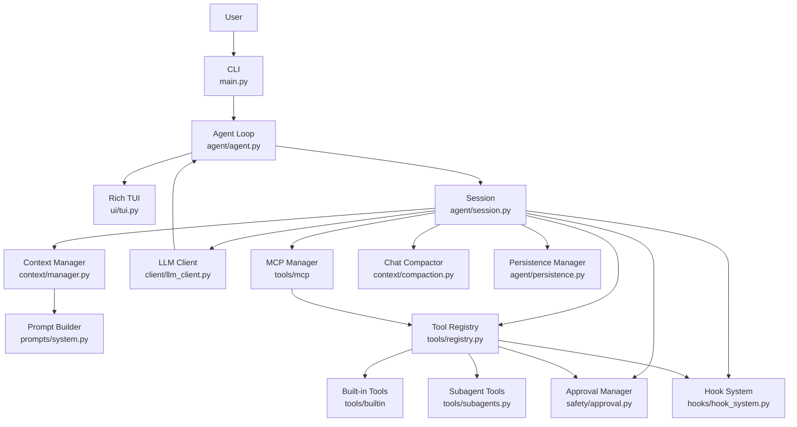
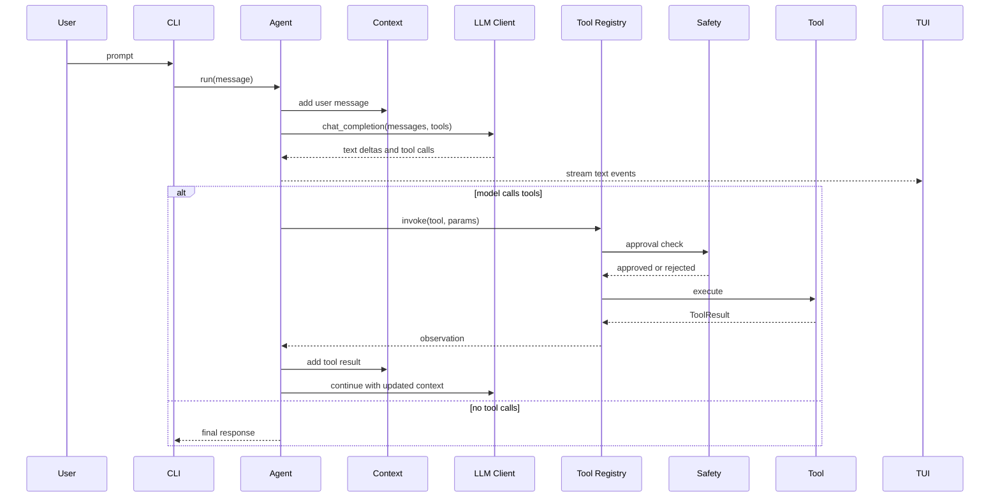
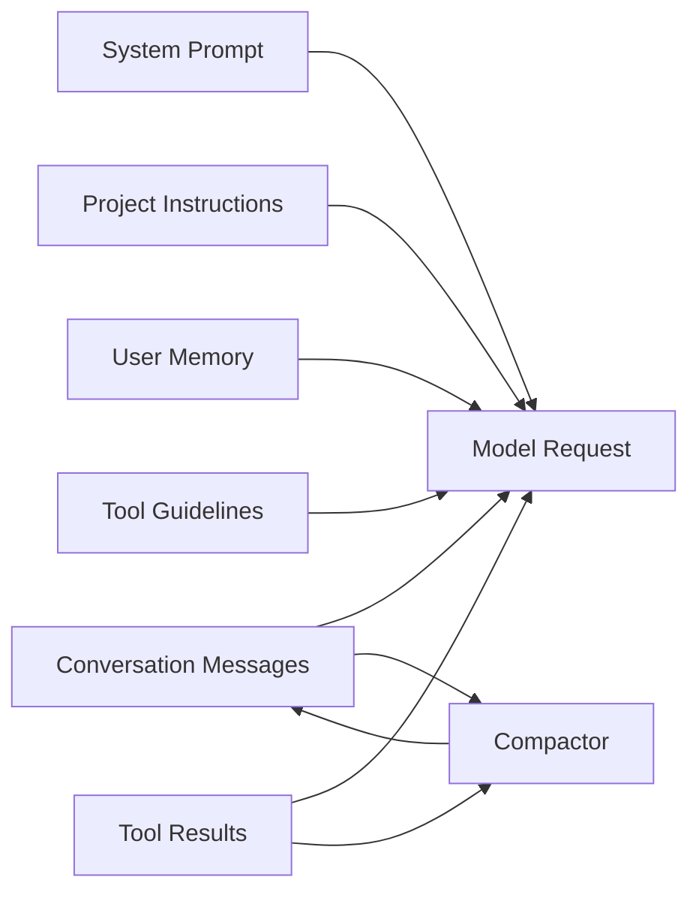
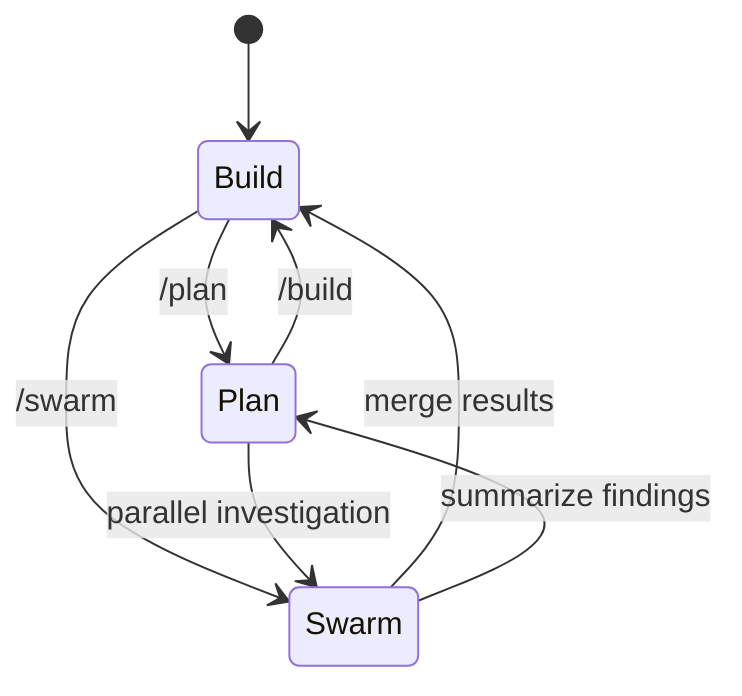
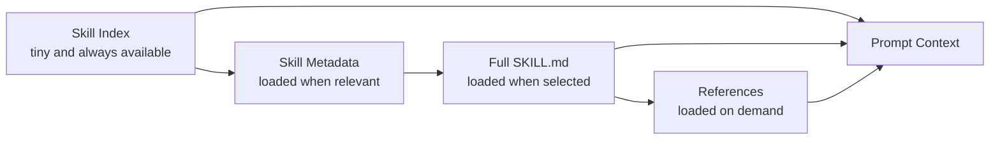

# AgentForge

AgentForge is a terminal-based AI coding-agent harness built in Python for learning how modern coding agents are structured. It is not just a chatbot wrapper: the project is organized around the core harness concerns that make coding agents reliable, inspectable, and safe.

The project currently supports streaming model responses, typed tool calls, approval gates, hooks, MCP tools, subagents, context compaction, loop detection, persistent memory, session snapshots, checkpoints, event logs, resume/restore commands, and a Rich terminal UI. The next major learning milestones are progressive-disclosure skills, deterministic replay, plan/build modes, and read-only swarm orchestration.

## Purpose

This repository is intended as a learning lab for AI harness engineering.

The main concepts explored here are:

| Area | What It Teaches |
| --- | --- |
| Agent loop | How a model alternates between reasoning, tool calls, observations, and final answers |
| Tool registry | How tools become schema-first actions the model can call |
| Tool observations | How outputs shape recovery, retries, and model behavior |
| Context management | How prompts, messages, tool results, memory, and compaction fit in the context window |
| Safety and approval | How mutating operations are classified, reviewed, and blocked |
| Hooks | How external scripts can observe agent and tool lifecycle events |
| MCP integration | How external tool servers are exposed to the model |
| Subagents | How a parent agent delegates bounded specialist work |
| Skills | How task-specific guidance can be loaded progressively without bloating context |
| Persistence and replay | How snapshots, event logs, and checkpoints make sessions recoverable and debuggable |

## Architecture



### Runtime Flow



### Context Flow



## Project Structure

```text
agentforge/
|-- main.py                    # CLI entry point and interactive commands
|-- README.MD                  # Project documentation
|-- requirements.txt           # Python dependencies
|-- .env.example               # Example API configuration
|-- .agentforge/
|   |-- config.toml            # Project-local config
|   `-- tools/                 # Project-local dynamic tools
|-- agent/
|   |-- agent.py               # Core ReAct-style agent loop
|   |-- events.py              # Agent lifecycle and streaming events
|   |-- persistence.py         # Session snapshots, checkpoints, and event logs
|   `-- session.py             # Session wiring for client, tools, context, hooks
|-- client/
|   |-- llm_client.py          # OpenAI-compatible streaming/non-streaming client
|   `-- response.py            # StreamEvent, TokenUsage, ToolCall types
|-- config/
|   |-- config.py              # Pydantic config models
|   `-- loader.py              # TOML and .env loading
|-- context/
|   |-- manager.py             # Message history, pruning, prompt assembly
|   |-- compaction.py          # Summary-based context compaction
|   `-- loop_detector.py       # Repeated action and cycle detection
|-- hooks/
|   `-- hook_system.py         # Before/after agent/tool hooks
|-- prompts/
|   `-- system.py              # System prompt sections and compaction prompts
|-- safety/
|   `-- approval.py            # Approval policy and command safety checks
|-- tools/
|   |-- base.py                # Tool, ToolResult, ToolConfirmation abstractions
|   |-- registry.py            # Tool registration and invocation
|   |-- discovery.py           # Dynamic .agentforge/tools discovery
|   |-- subagents.py           # Subagent tool definitions
|   |-- builtin/               # Built-in read/write/shell/search/memory tools
|   `-- mcp/                   # MCP client, manager, and tool adapter
|-- ui/
|   `-- tui.py                 # Rich terminal rendering
`-- utils/
    |-- paths.py               # Path helpers and binary-file detection
    `-- text.py                # Token counting and truncation
```

## Core Design

### Agent Loop

The agent loop in `agent/agent.py` is the heart of the harness.

At a high level it:

1. Adds the user message to context.
2. Sends messages and tool schemas to the model.
3. Streams text deltas to the TUI.
4. Collects completed tool calls.
5. Executes tools through the registry.
6. Adds tool results back to context.
7. Repeats until the model returns no tool calls.

This is a hybrid ReAct/function-calling loop: the model reasons in natural language and acts through typed tools.

### Session

`agent/session.py` wires together the long-lived objects for one interactive run:

- `LLMClient`
- `ToolRegistry`
- `MCPManager`
- `ContextManager`
- `ApprovalManager`
- `HookSystem`
- `ChatCompactor`
- `LoopDetector`
- `PersistenceManager`
- session ID and turn count

The session owns snapshot creation and restoration. It captures conversation messages, token usage, config metadata, active tools, MCP server names, todos, and event sequence state. Mode state and active skills are represented in the snapshot schema, but the actual skill loader and mode controller are still planned.

### Tools

Tools inherit from `Tool` in `tools/base.py`.

Each tool provides:

- a stable `name`
- a `description`
- a `ToolKind`
- a Pydantic schema
- an async `execute()` method
- optional approval metadata through `get_confirmation()`

Built-in tools include:

| Tool | Kind | Purpose |
| --- | --- | --- |
| `read_file` | read | Read text files with line numbers |
| `write_file` | write | Create or overwrite files |
| `append_file` | write | Append text to the end of a file |
| `edit` | write | Replace exact text in files |
| `apply_patch` | write | Apply a unified diff across one or more files |
| `shell` | shell | Run shell commands with timeout and approval |
| `list_dir` | read | List directory entries |
| `grep` | read | Search file contents with regex |
| `glob` | read | Find files by glob pattern |
| `todos` | memory | Track session tasks |
| `memory` | memory | Store user preferences and notes |
| `web_search` | network | Search the web |
| `web_fetch` | network | Fetch URL content |

### Tool Invocation Contract

The registry is responsible for:

1. Looking up the tool.
2. Validating params against the schema.
3. Running before-tool hooks.
4. Checking approval for mutating operations.
5. Executing the tool.
6. Running after-tool hooks.
7. Returning a `ToolResult`.

Future improvement: evolve `ToolResult` from mostly raw text into a structured observation:

```json
{
  "status": "success",
  "summary": "Read 120 lines from README.MD",
  "artifacts": ["README.MD"],
  "next_actions": [],
  "error_type": null,
  "retryable": false
}
```

This is one of the most important harness-learning upgrades because model recovery quality depends heavily on observation quality.

### Safety and Approval

The approval layer in `safety/approval.py` classifies operations using:

- tool mutability
- command safety patterns
- affected paths
- danger flags from tools
- configured approval policy

Supported approval modes:

| Mode | Meaning |
| --- | --- |
| `on-request` | Ask before non-safe mutating operations |
| `on-failure` | Allow most operations, useful for autonomous retries |
| `auto` | Auto-approve most operations except explicitly dangerous ones |
| `auto-edit` | Auto-approve safe commands, ask for edits and riskier operations |
| `never` | Reject non-safe operations |
| `yolo` | Approve all operations, including dangerous ones |

Future improvement: replace simple safe/dangerous command regexes with command classes such as `read-only`, `test`, `build`, `install`, `git-write`, `server`, `network`, and `destructive`.

### Hooks

Hooks let external scripts observe or react to lifecycle events.

Supported triggers:

| Trigger | When It Runs |
| --- | --- |
| `before_agent` | Before a user message enters the agent loop |
| `after_agent` | After the agent returns a response |
| `before_tool` | Before a tool is executed |
| `after_tool` | After a tool returns |
| `on_error` | When explicit error handling is added |

Hooks are configured in `.agentforge/config.toml`.

Hook commands receive AgentForge runtime context through environment variables:

| Variable | Meaning |
| --- | --- |
| `AGENTFORGE_TRIGGER` | Hook trigger name |
| `AGENTFORGE_CWD` | Agent working directory |
| `AGENTFORGE_TOOL_NAME` | Tool name for tool hooks |
| `AGENTFORGE_TOOL_PARAMS` | JSON-encoded tool params |
| `AGENTFORGE_TOOL_RESULT` | Tool result text for after-tool hooks |
| `AGENTFORGE_USER_MESSAGE` | User message for agent hooks |
| `AGENTFORGE_RESPONSE` | Agent response for after-agent hooks |
| `AGENTFORGE_ERROR` | Error text for error hooks |

Example:

```toml
hooks_enabled = true

[[hooks]]
name = "test_before_tool"
trigger = "before_tool"
command = "python3 ./scripts/test_tool.py"
```

Future improvement: add blocking/non-blocking hook policy:

```toml
failure_mode = "block" # block | warn | ignore
```

### MCP Integration

The MCP layer allows external MCP servers to expose tools to the agent.

Configuration example:

```toml
[mcp_servers.filesystem]
command = "npx"
args = [
  "-y",
  "@modelcontextprotocol/server-filesystem",
  "/path/to/agentforge"
]
```

MCP tools are registered with names like:

```text
filesystem__read_file
```

The `server__tool` naming pattern avoids collisions between built-in tools and remote tools.

### Subagents

Subagents are specialist agents exposed as tools.

Current examples:

- `subagent_explore`
- `subagent_debugger`
- `subagent_codebase_investigator`
- `subagent_code_reviewer`
- `subagent_test_planner`
- `subagent_architect`
- project-defined subagents from config

The built-in subagents are read-only by default. They can inspect files, grep, glob, and list directories, but they do not edit files. This makes them useful for safe delegation before adding full swarm orchestration.

Subagents are useful for bounded delegation:

```text
Parent agent -> subagent(goal) -> isolated specialist loop -> result
```

They are not the same as swarm mode. Subagents are tool-level delegation; swarm mode is a harness-level orchestration strategy that manages multiple agents, budgets, shared task state, and result merging.

### Context Management

The context manager owns:

- the system prompt
- user messages
- assistant messages
- tool results
- token usage
- pruning old tool output
- replacing old history with a compaction summary

Compaction is handled by `context/compaction.py`, which asks the model to produce a continuation summary when context grows too large.

Future improvement: add explicit category budgets:

| Category | Example Budget |
| --- | --- |
| System prompt | fixed and small |
| Active skills | capped by selected task |
| Recent messages | preserve latest turns |
| Tool results | preserve recent and artifact-bearing results |
| File reads | summarize older reads |
| Memory | compact and user-specific |
| Compaction summaries | preserve phase boundaries |

## Modes Roadmap

The project should evolve toward three top-level modes:

| Mode | Purpose | Tool Policy |
| --- | --- | --- |
| Plan | Inspect, reason, and design an approach | Read-only tools; block mutations |
| Build | Implement, test, and verify | Normal tools through approval policy |
| Swarm | Coordinate multiple agents for large tasks | Orchestrated workers with scoped tools |



### Plan Mode

Plan mode should:

- inspect files
- search the codebase
- ask clarifying questions
- produce a plan
- block mutating tools at the registry layer

This must be enforced by the harness, not only by prompt text.

### Build Mode

Build mode should:

- create a checkpoint before first mutation
- edit files
- run tests and checks
- summarize changed files
- report verification results

### Swarm Mode

Swarm mode should start as read-only.

The first useful version:

```text
/swarm investigate "why shell commands sometimes hang"
```

The orchestrator can spawn multiple read-only agents with different goals, then merge findings.

Write-capable swarm mode should wait until workspace rollback, file ownership, cancellation, and deterministic replay are in place.

## Skills Roadmap

Skills should be implemented using progressive disclosure.



Recommended layout:

```text
.skills/
|-- debugging/
|   |-- SKILL.md
|   `-- references/
|-- tdd/
|   `-- SKILL.md
`-- code-review/
    `-- SKILL.md
```

Skill loading should follow this rule:

```text
Always show what skills exist.
Only load full skill text when selected.
Only load reference files when the skill asks for them.
```

## Persistence, Checkpoints, and Replay

AgentForge now has a first version of transcript persistence. The implementation lives in `agent/persistence.py` and is wired through `agent/session.py` and the interactive commands in `main.py`.

Persistence is split into three surfaces:

| Surface | Status | Purpose |
| --- | --- | --- |
| Session snapshot | implemented | Resume an interactive session after saving |
| Event log | implemented | Inspect what happened during a run |
| Checkpoint | implemented | Restore chat/context state to a saved point |
| Deterministic replay | planned | Re-run a recorded trace without calling the model |
| Workspace rollback | planned | Restore file state, not only chat/context state |

### Session Snapshots

Snapshots are stored under the platform data directory for `agentforge` in `sessions/`.

Each snapshot stores:

- schema version
- session ID
- created/updated timestamps
- turn count
- working directory
- redacted config snapshot
- message history with tool call metadata
- latest and total token usage
- active tool names
- MCP server names
- todo state
- event sequence
- mode placeholder

Snapshot writes are atomic and saved files are restricted to owner-only permissions.

### Event Logs

Every agent event handled by the CLI is appended to JSONL under `events/`.

```json
{
  "schema_version": 1,
  "session_id": "uuid",
  "turn": 3,
  "sequence": 42,
  "type": "tool_call_complete",
  "timestamp": "2026-05-21T12:00:00Z",
  "payload": {}
}
```

This is the foundation for replay, debugging, evals, and UI trace inspection.

### Checkpoints

Checkpoints are currently session snapshots stored under `checkpoints/`. They restore chat/context state, usage, todos, and session metadata.

Current checkpoint state includes:

- message history
- token usage
- redacted config snapshot
- working directory
- active tools and MCP server names
- todos
- event sequence

Still planned:

- changed-file snapshots
- git diff capture
- checkpoint reasons, such as manual, before mutating tool, or before dangerous command
- workspace restore
- deterministic replay from event logs

## Configuration

Configuration is loaded from:

1. `.env`
2. user config directory from `platformdirs`
3. project-local `.agentforge/config.toml`

### Environment Variables

| Variable | Purpose |
| --- | --- |
| `API_KEY` | API key for the OpenAI-compatible provider |
| `BASE_URL` | Base URL for the provider |
| `OPENROUTER_API_KEY` | Alternative OpenRouter API key name |
| `OPENROUTER_BASE_URL` | Alternative OpenRouter base URL name |

Example:

```env
BASE_URL=https://openrouter.ai/api/v1
API_KEY=sk-or-v1-...
```

### Project Config

Example `.agentforge/config.toml`:

```toml
hooks_enabled = true
approval = "on-request"
max_turns = 100

[model]
name = "deepseek/deepseek-v4-flash:free"
temperature = 1.0
context_window = 256000

[[subagents]]
name = "code-explainer"
description = "Explains how specific code works"
goal_prompt = "You are a code explanation specialist."
allowed_tools = ["read_file", "glob", "list_dir"]
max_turns = 10
timeout_seconds = 120

[[hooks]]
name = "test_before_tool"
trigger = "before_tool"
command = "python3 ./scripts/test_tool.py"
```

## CLI Usage

Run a single prompt:

```bash
python main.py "read main.py and explain the agent loop"
```

Start interactive mode:

```bash
python main.py
```

Use a different working directory:

```bash
python main.py --cwd /path/to/project
```

Interactive commands:

| Command | Status | Purpose |
| --- | --- | --- |
| `/help` | implemented | Show commands |
| `/exit`, `/quit` | implemented | Exit interactive mode |
| `/clear` | implemented | Clear conversation history |
| `/config` | implemented | Show redacted config |
| `/model <name>` | implemented | Change model for current session |
| `/approval <mode>` | implemented | Change approval policy |
| `/tools` | implemented | Show registered tools |
| `/mcp` | implemented | Show MCP server status |
| `/stats` | implemented | Show token/session stats |
| `/save` | implemented | Save current session snapshot |
| `/checkpoint` | implemented | Create checkpoint from current session |
| `/restore <checkpoint_id>` | implemented | Restore checkpoint state |
| `/checkpoints` | implemented | List saved checkpoints |
| `/sessions` | implemented | List saved sessions |
| `/resume <session_id>` | implemented | Resume saved session |
| `/plan` | planned | Switch to plan mode |
| `/build` | planned | Switch to build mode |
| `/swarm` | planned | Run swarm orchestration |

## Development

Install dependencies:

```bash
python -m venv .venv
source .venv/bin/activate
pip install -r requirements.txt
```

Compile-check the codebase:

```bash
python3 -m compileall -q agent client config context hooks prompts safety tools ui utils main.py scripts
```

Run a focused syntax check:

```bash
python3 -m py_compile agent/agent.py tools/registry.py context/manager.py
```

Recommended future test layout:

```text
tests/
|-- test_agent_loop.py
|-- test_tool_registry.py
|-- test_approval.py
|-- test_context_compaction.py
|-- test_loop_detector.py
|-- test_transcript_replay.py
`-- test_checkpoints.py
```

## Learning Roadmap

Completed foundation:

1. Stabilize current loop, hooks, tools, config, and TUI.
2. Add transcript persistence.
3. Integrate loop detector.
4. Add session checkpoints.

Recommended next implementation order:

1. Add deterministic replay from event logs.
2. Add structured tool observations.
3. Add progressive-disclosure skills.
4. Add plan/build modes.
5. Add read-only swarm mode.
6. Add eval harness.
7. Add workspace rollback for checkpoints.
8. Add write-capable swarm mode with file ownership.

## Current Status

Implemented:

- Streaming LLM client
- OpenAI-compatible API support
- Rich TUI
- Tool registry and Pydantic schemas
- Built-in file/search/shell/web/memory tools
- Dynamic local tool discovery from `.agentforge/tools`
- Approval manager
- Hook system
- MCP tool adapter
- Subagents
- Context manager
- Compaction scaffolding
- Persistent user memory
- Loop detector integration
- Session snapshots
- Event JSONL logs
- Checkpoints
- Resume and restore commands

In progress or planned:

- Deterministic replay
- Progressive-disclosure skills
- Plan/build modes
- Swarm mode
- Structured tool observation contract
- Eval harness
- Workspace rollback for checkpoints

## Design Principles

1. Keep tools schema-first and explicit.
2. Keep system prompt small and stable.
3. Load large guidance through skills on demand.
4. Treat tool outputs as observations, not just strings.
5. Enforce safety in the harness, not only in prompts.
6. Record enough state to replay and debug failures.
7. Add orchestration only after persistence and checkpoints exist.

## License

MIT
