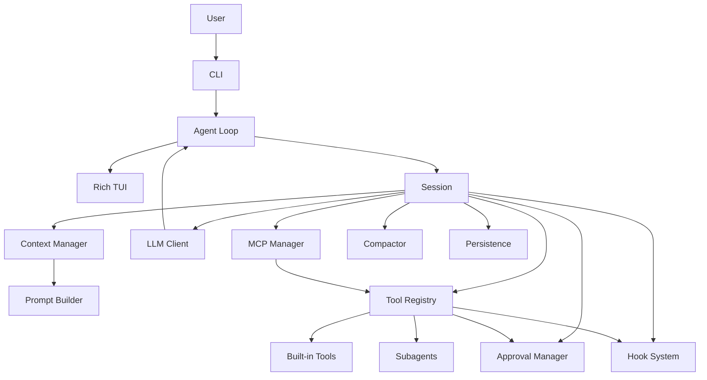

# Architecture

AgentForge is organized as a small coding-agent harness. The important idea is that the model does not act directly. It emits typed tool calls, and the harness validates, approves, executes, records, and returns observations.

## System Shape

## Runtime Flow

1. The CLI receives a user message.
2. The agent adds the message to context.
3. The context manager assembles system prompt, messages, active skills, and recent observations.
4. The LLM client sends the request to the configured provider.
5. The model streams text and may emit tool calls.
6. The tool registry validates tool params.
7. The approval manager checks whether a mutating action needs confirmation.
8. The tool executes and returns a `ToolResult`.
9. Output hygiene, redaction, and prompt-injection wrapping run.
10. Hooks observe the lifecycle.
11. The result is added back to context.
12. The loop continues until the model returns a final answer.

## Core Modules

| Module | Responsibility |
| --- | --- |
| `agentforge_harness/agent/agent.py` | Async model/tool loop |
| `agentforge_harness/agent/session.py` | Long-lived runtime container for one session |
| `agentforge_harness/client/llm_client.py` | Provider-aware model calls |
| `agentforge_harness/context/manager.py` | Messages, token estimates, pruning, and system prompt refresh |
| `agentforge_harness/context/compaction.py` | Model-assisted history compaction |
| `agentforge_harness/context/loop_detector.py` | Repeated-action and cycle detection |
| `agentforge_harness/tools/registry.py` | Tool lookup, validation, approval, execution, cleanup, and hooks |
| `agentforge_harness/tools/base.py` | `Tool`, `ToolResult`, and approval metadata types |
| `agentforge_harness/safety/approval.py` | Approval policy and dangerous-action checks |
| `agentforge_harness/safety/output_hygiene.py` | ANSI/control-character cleanup and output caps |
| `agentforge_harness/safety/prompt_injection.py` | Untrusted observation marking |
| `agentforge_harness/utils/redaction.py` | Secret redaction |
| `agentforge_harness/skills/manager.py` | Skill index, matching, and activation |
| `agentforge_harness/hooks/hook_system.py` | Lifecycle hooks |
| `agentforge_harness/tools/mcp/` | MCP server/client integration |
| `agentforge_harness/ui/tui.py` | Rich terminal rendering |
| `agentforge_harness/agent/persistence.py` | Sessions, checkpoints, and event persistence |

## Harness Boundaries

AgentForge enforces behavior in the harness instead of relying only on prompts:

- Plan mode filters mutating tools.
- Approval policies gate shell and write operations.
- Tool schemas validate model arguments.
- Tool observations are cleaned and redacted before reaching model context.
- Prompt-injection handling marks file, shell, web, and MCP output as untrusted data.
- Persistence records sessions and events for later inspection.

## Design Principle

Keep the model flexible, but keep the harness strict. The model can decide what to do next; the harness decides what actions are available, how actions are validated, what requires approval, and how observations return to context.
